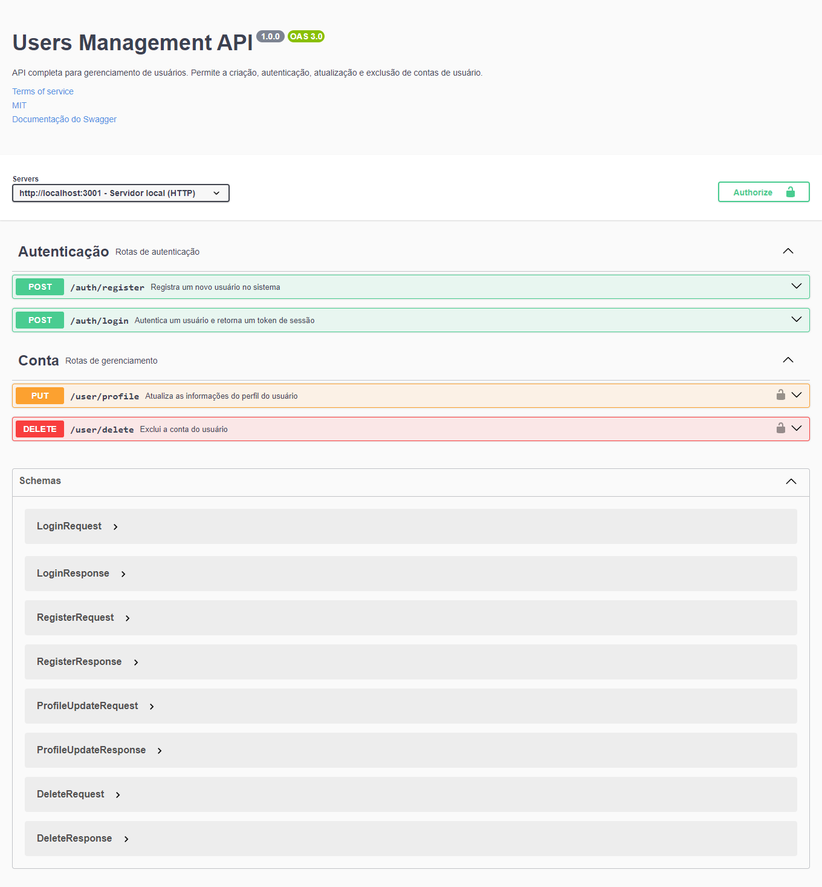

# Users Management API

<div display="flex">
  
  
 
 
 
 
 
 
</div>



## Sumário

- [Introdução](#introdução)
- [Instalação e execução](#instalação-e-execução)
- [Variáveis de ambiente](#variáveis-de-ambiente)
- [Visão geral da API](#visão-geral-da-api)
- [Documentação do Swagger](#documentação-do-swagger)
- [Funcionalidades](#funcionalidades)
- [Endpoints](#endpoints)
    - [Login](#1-login)
    - [Registro](#2-registro)
    - [Atualizar perfil](#3-atualizar-perfil)
    - [Deletar conta](#4-excluir-conta)
- [Tecnologias utilizadas](#tecnologias-utilizadas)
- [Autor e Licença](#autor-e-licença)

## Introdução

Bem-vindo à documentação da Users Management API! Esta documentação fornece informações detalhadas sobre como usar a 
API, incluindo endpoints disponíveis, parâmetros aceitos, códigos de status e exemplos práticos. A documentação Swagger está disponível para uma visão mais interativa da API.

## Instalação e execução
#### Para instalar e executar o projeto, siga os passos abaixo:

1. Clone o repositório:
- Abra o terminal e execute o comando abaixo para clonar o repositório:

  ```bash
    git clone https://github.com/luizfelipe9627/users-management.git
  ```

2Defina as variáveis de ambiente:
- Siga as instruções do tópico [Variáveis de ambiente](#variáveis-de-ambiente) para definir as variáveis de ambiente no arquivo `.env`.

4. Instale o Docker:
- Para instalar o Docker, siga as instruções no link abaixo:

  ```bash
    https://docs.docker.com/get-docker/
  ```

5. Inicie as Imagens do Docker:

- Para rodar todas as imagens juntas execute o comando abaixo:

  Para criar a imagem do Node.JS e do MySQL e já iniciar os containers:
  ```bash
    npm run docker:all
  ```

- Caso deseje rodar apenas o Node.JS, execute o comando abaixo:

  Para criar a imagem do Node.JS e iniciar o container:
    ```bash
      npm run docker:app
    ```

- Caso deseje rodar junto com o MySQL, execute o comando abaixo:

  Para criar a imagem do MySQL e iniciar o container:
    ```bash
      npm run docker:db
    ```

6. Acesse o servidor local:
- Acesse no terminal do editor de código ou no do Docker o link do servidor local, sendo a porta definida no arquivo `.env`:

  ```bash
    http://localhost:3001
  ```

## Variáveis de ambiente

- Caso deseje rodar o projeto em ambiente de desenvolvimento, copie o arquivo `.env.dev.example` e renomeie para `.env`. Os valores padrões não podem ser alterados, pois são necessários para o funcionamento correto do Docker com o MySQL.

  ```bash
    PORT=3001 # Para que o swagger funcione corretamente, a porta deve ser a definida por padrão.
    NODE_ENV=development # Para rodar com o nodemon, o valor dessa variável deve ser 'development'.
    MYSQL_HOST=db # Para rodar com o Docker Compose, o valor dessa variável deve ser passado pois é nome do serviço do container do MySQL.
    MYSQL_USER=root # Seu usuário local do seu MySQL.
    MYSQL_PASSWORD=root # Sua senha local do seu MySQL.
    MYSQL_DATABASE=users_management # Para rodar com o Docker Compose, o valor dessa variável deve ser 'users_management', pois é o nome do banco de dados que será criado no MySQL.
    JWT_SECRET=sua_chave_secreta # Chave secreta obrigatória para gerar o token JWT.
  ```

- Caso deseje rodar o projeto em ambiente de produção(deploy), copie o arquivo `.env.prod.example` e renomeie para `.env`. Todos os valores das variáveis de ambiente podem ser alterados, exceto o valor da variável `NODE_ENV`, que deve ser `production`.

  ```bash
    # Para que o swagger funcione corretamente, a porta deve ser a definida por padrão.
    PORT=3001 

    # Para rodar com o node em ambiente de produção, o valor dessa variável deve ser 'production'.
    NODE_ENV=production 

    # Preencha todas as variáveis a seguir com as configurações passadas pelo seu provedor do banco de dados.
    MYSQL_HOST=
    MYSQL_USER= 
    MYSQL_PASSWORD=
    MYSQL_DATABASE=

    # Chave secreta obrigatória para gerar o token JWT.
    JWT_SECRET=
  ```

## Visão geral da API
#### A API foi projetada para ser fácil e simples de usar. Abaixo estão alguns pontos importantes para começar:

- **Base URL**: O endpoint base para todas as chamadas da API é [http://localhost:3001].
- **Autenticação**: A autenticação é feita por meio de tokens JWT. Para acessar os endpoints protegidos, é necessário incluir o token de sessão retornado após o login nas solicitações subsequentes.
- **Parâmetros de solicitação**: Os parâmetros de solicitação são passados no corpo da solicitação em formato JSON. Exemplos de corpo de solicitação são fornecidos na documentação abaixo para cada endpoint.
- **Respostas**: As respostas da API são retornadas em formato JSON. Exemplos de corpo de resposta são fornecidos na documentação abaixo para cada endpoint.
- **Códigos de status**: A API retorna códigos de status padrão, como 200 para solicitações bem-sucedidas, 400 para solicitações inválidas e 500 para erros internos do servidor.

## Documentação do Swagger

Explore e teste a API de forma interativa usando a documentação local do Swagger. Acesse [Swagger Local](http://localhost:3001) para obter uma visão visual completa dos endpoints, parâmetros e exemplos. Só é possível acessar a documentação do Swagger localmente após a instalação e execução do projeto.

## Funcionalidades

A API users-management fornece as seguintes funcionalidades:

- **Login**: Permite que usuários autentiquem-se fornecendo um e-mail e uma senha. Se as credenciais forem válidas, um token de sessão é gerado e retornado.
- **Registro**: Permite que novos usuários se registrem fornecendo um nome, um e-mail e uma senha. Se o registro for bem-sucedido, um token de sessão é gerado e retornado.
- **Alterar informações da conta**: Permite que um usuário autenticado atualize seu perfil fornecendo um e-mail, um nome e/ou uma senha. Pelo menos um campo deve ser preenchido para realizar a atualização.
- **Deletar conta**: Permite que um usuário autenticado exclua sua conta fornecendo um token de sessão e a senha da conta. Após a exclusão, o usuário não estará mais presente na base de dados.

## Recursos principais e Exemplos

### 1. Login

Autentica um usuário fornecendo o email e a senha. Retorna um token de sessão se as credenciais forem válidas.

- **Endpoint**: `/auth/login`
- **Método**: `POST`

**Exemplo de corpo da solicitação:**

```json
{
  "email": "luiz@email.com",
  "password": "luiz@123"
}
```

**Exemplo de resposta:**

```json
{
  "token": "eyJhbGciOiJIUzI1NiIsInR5cCI6IkpXVCJ9.eyJ1c2VySWQiOjYs..."
}
```

### 2. Registro

Registra um novo usuário fornecendo o email e a senha. Retorna um token de sessão se o registro for bem-sucedido.

- **Endpoint**: `/auth/register`
- **Método**: `POST`

**Exemplo de corpo da solicitação:**

```json
{
  "name": "Luiz",
  "email": "luiz@email.com",
  "password": "luiz@123"
}
```

**Exemplo de resposta:**

```json
{
  "token": "203kdslJhbGciOiJIUzI1NiIsInR5cCI6IkpXVCJ9.29dskladaskoLDLP..."
}
```

### 3. Atualizar perfil

Atualiza as informações do perfil do usuário. É necessário estar autenticado para acessar este endpoint. Pelo menos um campo deve ser preenchido para realizar a atualização.

- **Endpoint**: `/user/profile`
- **Método**: `PUT`

**Exemplo de corpo da solicitação:**

```json
{
  "id": 0,
  "name": "Luiz Felipe",
  "email": "luizfelipe@email.com",
  "password": "lf@321",
}
```

**Exemplo de resposta:**

```json
{
  "id": 0,
  "name": "Luiz Felipe",
  "email": "luizfelipe@email.com",
  "password": "$10$F.kzUfuFDhYXuJFeu5YHLusEi.TzXi3X02H...",
  "token": "sdasSKEI281.92udjeKGORN4.eyJ1c2VySWQiOjYs..."
}
```

### 4. Excluir conta

Exclui a conta do usuário. É necessário estar autenticado para acessar este endpoint.

- **Endpoint**: `/user/delete`
- **Método**: `DELETE`

**Exemplo de corpo da solicitação:**

```json
{
  "password": "lf@321"
}
```

**Exemplo de resposta:**

```json
{
  "message": "Perfil excluído com sucesso."
}
```

## Tecnologias utilizadas

- [Node.js](https://nodejs.org/en/): Ambiente de execução JavaScript server-side.
- [Express](https://expressjs.com/): Framework web para Node.js.
- [MySQL2](https://www.npmjs.com/package/mysql2): Cliente MySQL para Node.js.
- [Swagger](https://swagger.io/): Framework de código aberto para APIs.
- [Docker](https://www.docker.com/): Plataforma de software que fornece contêineres.
- [Docker Compose](https://docs.docker.com/compose/): Ferramenta para definir e executar aplicativos Docker multi-container.
- [Nodemon](https://www.npmjs.com/package/nodemon): Ferramenta que monitora as alterações no código e reinicia automaticamente o servidor.
- [Dotenv](https://www.npmjs.com/package/dotenv): Módulo que carrega variáveis de ambiente de um arquivo `.env` para `process.env`.
- [Cors](https://www.npmjs.com/package/cors): Middleware para habilitar o CORS com várias opções.
- [Jsonwebtoken](https://www.npmjs.com/package/jsonwebtoken): Biblioteca para geração e verificação de JSON Web Tokens (JWT).
- [Bcrypt](https://www.npmjs.com/package/bcrypt): Biblioteca para criptografia de senhas.
- [Zod](https://www.npmjs.com/package/zod): Biblioteca para validação de esquemas e dados.

## Autor e Licença

Este projeto foi desenvolvido por [Luiz Felipe Silva](https://github.com/luizfelipe9627) e está sob a licença MIT. Veja o arquivo [LICENSE](./LICENSE.md) para mais detalhes.
